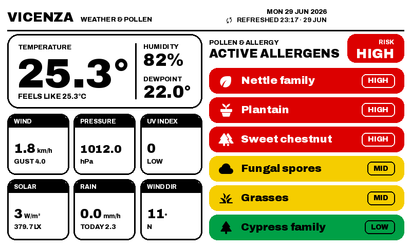
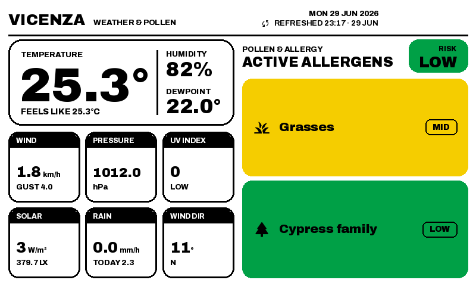
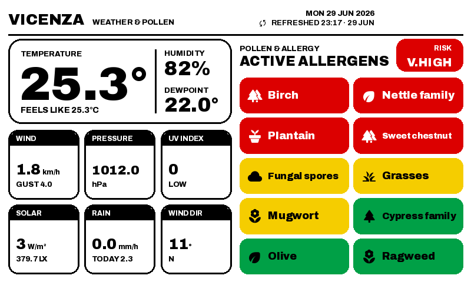
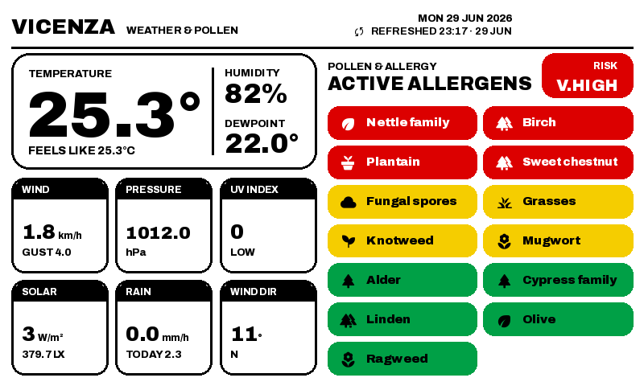
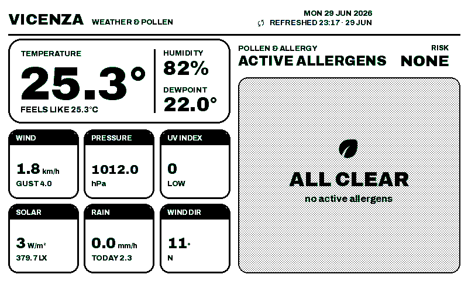
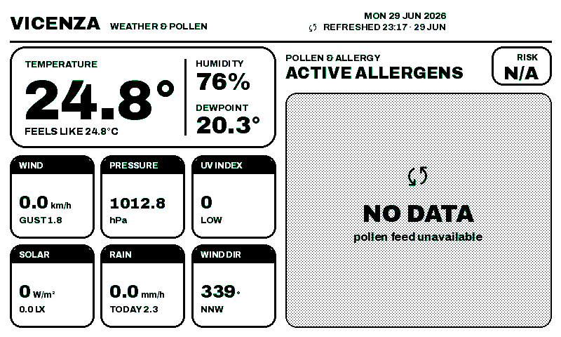
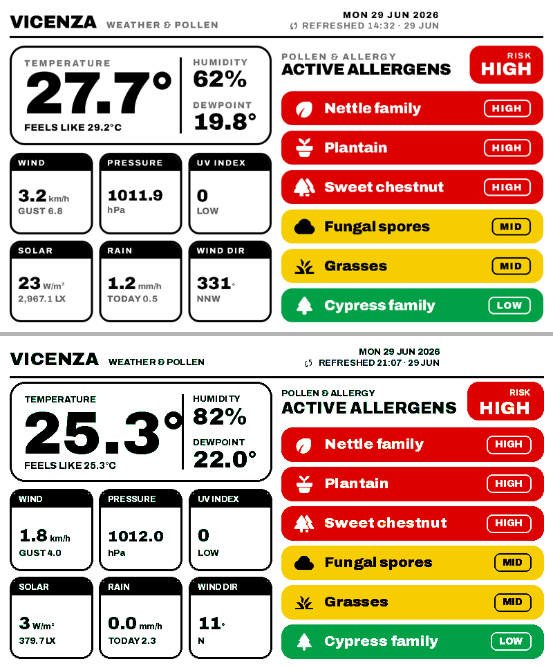

# reTerminal E1002 — Home Assistant weather & pollen dashboard

A "render & download" e-ink dashboard for the **Seeed Studio reTerminal E1002**
(7.3″ Spectra-6 colour e-paper, ESP32-S3). **Home Assistant** renders an
800×480 PNG with [Pillow](https://python-pillow.org/), and the device fetches
that PNG over plain HTTP via [ESPHome](https://esphome.io/) firmware — no
templating on the device, no cloud.

- **Left column:** live weather from an Ecowitt "Wittboy" station.
- **Right column:** a dynamic, severity-sorted pollen / allergen list.

Strict 7-colour Spectra-6 palette with nearest-colour quantization (no
dithering) for crisp, flat UI on e-ink.



> A typical day — 6 active allergens, single column, severity-sorted
> (HIGH → MID → LOW) with colour-coded level badges.

---

## How it works (render & download)

```
┌─────────────────────────────────────────────┐         ┌──────────────────────────┐
│ Home Assistant                               │         │ reTerminal E1002         │
│                                              │         │ (ESP32-S3 + Spectra-6)   │
│  sensor.wittboy_*  ┐                         │         │                          │
│  sensor.polleninfo ┘                         │  HTTP   │  online_image (RGB565)   │
│        │                                     │  GET    │        │                 │
│        ▼                                     │ ◄───────┼──  fetch PNG on wake /   │
│  custom_components/edashboard                │  PNG    │    button / 30-min timer │
│   render.py  → 800×480 RGB (Pillow)          │ ───────►│        │                 │
│   epaper_format.py → nearest-colour EPD7     │         │        ▼                 │
│   http.py  → /api/edashboard/latest          │         │   epaper_spi display     │
│              (re-renders on each request)    │         │   (full refresh)         │
└─────────────────────────────────────────────┘         └──────────────────────────┘
```

1. The custom component reads **Home Assistant sensor states** (it does not need
   any external API at render time) and draws the layout with Pillow.
2. The RGB image is quantized to the **7-colour Spectra-6 palette** using
   nearest-colour mapping (`Image.Dither.NONE`).
3. The result is exposed at an HTTP endpoint:
   `GET /api/edashboard/latest?dashboard=<name>`. The endpoint **re-renders on
   demand** (with a short debounce) so the device always pulls current data.
4. The ESPHome firmware downloads that PNG into an `online_image` and blits it to
   the e-paper panel on a full refresh.

The endpoint is **unauthenticated by design** (the headless device can't carry a
token) — keep Home Assistant on a trusted LAN.

---

## Features

- **Dynamic, severity-sorted allergen layout.** Only *active* allergens are
  shown, sorted by severity then name. The list is **responsive**: a single
  column for ≤ 7 active allergens, switching to a **2-column grid** for > 7.
- **Distinct ALL-CLEAR vs NO-DATA states.** An empty list because everything is
  genuinely *none* shows a green **ALL CLEAR**; a *missing pollen feed* shows a
  neutral **NO DATA** panel with an **N/A** risk badge — never a misleading
  all-clear.
- **Spectra-6 palette, nearest-colour quantization.** Flat fills and text stay
  crisp on e-ink; no Floyd–Steinberg speckle.
- **On-demand render endpoint.** Every fetch re-renders first (debounced), so a
  button press or wake always shows fresh data.
- **Physical buttons → refresh + beep.** Left / center / right buttons trigger a
  refresh with a short buzzer tone.
- **Long-press panel-clean.** A ≥ 3 s press of the center button runs an e-ink
  ghosting clear (white → black → white → redraw) with a distinct two-tone beep.
- **Nightly panel-care clean** at 03:00 to fight image retention.
- **Home Assistant adoption** (ESPHome API) for diagnostics, battery %, WiFi
  signal, and a "Refresh Dashboard Now" button — while still working standalone
  over HTTP if HA is down.

---

## Rendering examples

All of these are produced by [`tools/localtest.py`](tools/localtest.py) with
mock sensor data — no hardware or HA install required.

| | |
|---|---|
|  |  |
| **Calm day** — 2 active allergens (one MID, one LOW), single column, LOW overall risk. | **Busy day** — 10 active allergens trip the 2-column grid; V.HIGH risk. |
|  |  |
| **Full grid** — all 13 tracked allergens active; the grid auto-fits names. | **ALL CLEAR** — genuinely no active allergens (shown *after* Spectra-6 quantization, i.e. as the panel sees it). |
|  |  |
| **NO DATA** — pollen feed unavailable; neutral panel + N/A risk badge, not a green all-clear. | **Design vs render** — the original design reference (top) next to the Python renderer's output (bottom) for the same scenario. |

---

## Repository layout

```
custom_components/edashboard/     The Home Assistant custom component (render & serve)
  backend_app/render.py             the whole design renderer (centrepiece)
  backend_app/epaper_format.py      nearest-colour Spectra-6 (EPD7) quantizer
  backend_app/service.py            render orchestration (skip_remote_fetch for on-demand)
  backend_app/{config,data_sources}.py
  __init__.py                       setup, scheduling, warm-up re-renders
  http.py                           render-on-demand HTTP endpoint
  const.py / manifest.json / services.yaml
  assets/fonts/*.ttf                bundled (subset) fonts
esphome/
  reterminal_e1002.yaml             device firmware
  secrets.yaml.example              copy to secrets.yaml and fill in
patches/polleninformation/
  __init__.py                       disk-cache patch for the upstream pollen integration
  README.md
docs/examples/                      the rendered PNGs embedded above
tools/
  localtest.py                      offline render harness (mock HA state)
  fonts_src/build_fonts.py          rebuild the bundled fonts (optional)
```

---

## Setup — Home Assistant

1. **Install the component.** Copy `custom_components/edashboard/` into your HA
   config directory:
   ```
   <config>/custom_components/edashboard/
   ```
   It depends only on Pillow, which is already present in Home Assistant.

2. **Configure it.** Add an `edashboard:` block to `configuration.yaml`:
   ```yaml
   edashboard:
     location: Vicenza, Italy   # geocoded via open-meteo; also names the dashboard
     refresh_seconds: 300       # background re-render cadence (min 15)
     temp_unit: C               # C or F
     wind_unit: km/h
   ```
   The `location:` string is geocoded and **sanitized into the dashboard key**
   used by the URL (`Vicenza, Italy` → `vicenza_italy`). With a single dashboard
   configured, the endpoint matches any `?dashboard=` value, so you don't have
   to get it exact.

   You can also configure **multiple dashboards** as a list/mapping (each gets
   its own output folder and `?dashboard=` key).

3. **Provide the sensors.** The renderer reads Home Assistant **sensor states**
   directly. Out of the box it expects:
   - **Weather:** `sensor.wittboy_*` (an Ecowitt "Wittboy" station via the
     Ecowitt integration) — e.g. `sensor.wittboy_outdoor_temperature`,
     `_humidity`, `_wind_speed`, `_absolute_pressure`, `_uv_index`,
     `_solar_radiation`, `_rain_rate_piezo`, …
   - **Pollen:** `sensor.polleninformation_<location>_*` — e.g.
     `sensor.polleninformation_vicenza_grasses`,
     `…_allergy_risk`, etc. (see the
     [`polleninformation`](patches/polleninformation/) integration).

   > **Adapt these to your setup — no code editing needed.** The entity prefixes
   > and the on-screen header title are **configurable** in the `edashboard:`
   > block; if you omit them they are derived from `location:`:
   >
   > ```yaml
   > edashboard:
   >   location: Vicenza, Italy
   >   # Optional overrides (defaults shown / derived from location):
   >   weather_prefix: "sensor.wittboy_"            # your Ecowitt/weather device prefix
   >   pollen_prefix: "sensor.polleninformation_vicenza_"  # derived: polleninformation_<city>_
   >   header_title: "VICENZA"                      # derived: the city, uppercased
   > ```
   >
   > Include the trailing underscore in the prefixes; the renderer appends the
   > metric/allergen name (e.g. `pollen_prefix` + `grasses`). The *set* of tracked
   > allergens (`POLLENS`) still lives in
   > [`backend_app/render.py`](custom_components/edashboard/backend_app/render.py)
   > if you want to add or remove species.

4. **(Recommended) Patch the pollen integration** so it survives the API's
   ~40 req/day limit and HA restarts — see
   [`patches/polleninformation/`](patches/polleninformation/).

5. **Restart Home Assistant.** The component renders once on startup and
   schedules two **warm-up re-renders** (~75 s and ~240 s later) to self-correct
   for sensors that are still populating after a restart. A
   `edashboard.generate_now` service is also registered for manual renders.

**Endpoint:** `GET http://homeassistant.local:8123/api/edashboard/latest?dashboard=<name>`
returns the quantized PNG (re-rendering first; add `?fresh=0` to skip).

---

## Setup — ESPHome (the device)

1. Put the firmware and a secrets file under your ESPHome config:
   ```
   <config>/esphome/reterminal_e1002.yaml
   <config>/esphome/secrets.yaml          # copy from esphome/secrets.yaml.example
   ```
   Fill in `wifi_ssid`, `wifi_password`, and a generated `api_encryption_key`
   (`openssl rand -base64 32`, or let the ESPHome dashboard generate one).

   > The firmware loads a font via
   > `../custom_components/edashboard/assets/fonts/Jost.ttf` — that relative path
   > assumes the standard HA layout where `esphome/` and `custom_components/` are
   > siblings under `/config`. This repo's folder layout mirrors that, so it
   > resolves the same way when building from a checkout.

2. Edit `image_url:` if needed (point it at your HA host, and set the
   `?dashboard=` value to your location). Use the IP form if mDNS `.local` is
   unreliable on your network.

3. **Change the AP fallback password** (`ChangeMe1234` is a weak placeholder).

4. Flash it — via the ESPHome dashboard, or:
   ```
   esphome run esphome/reterminal_e1002.yaml
   ```

### Buttons, buzzer & panel care

- **Left / Right buttons:** refresh now + short beep.
- **Center button:** short press = refresh + beep; **long press (≥ 3 s)** = panel
  clean (e-ink ghosting flush) + a distinct descending two-tone beep.
- **Auto-refresh:** every 30 min (panel-safe cadence; Seeed advises refreshing
  e-paper infrequently).
- **Nightly panel-care clean** at 03:00 (white → black → white → redraw).
- Buzzer is on **GPIO45** (LEDC/PWM, low gain).

### GPIO map

Hardware pin reference from
[XanderLuciano/reterminal](https://github.com/XanderLuciano/reterminal):

| Function | GPIO |
|---|---|
| Left button | GPIO5 |
| Center button | GPIO3 |
| Right button | GPIO4 |
| Buzzer | GPIO45 |
| e-paper SPI CLK / MOSI | GPIO7 / GPIO9 |
| Battery ADC | GPIO1 |

---

## Design notes

- **Nearest-colour, not Floyd–Steinberg.** The UI is composed entirely of flat
  Spectra-6 palette colours, so a nearest-colour map keeps text edges and solid
  badges razor-sharp. Diffusion dithering would only add speckle and bleed on the
  flat fills. (See `dither_to_epd7()` in
  [`epaper_format.py`](custom_components/edashboard/backend_app/epaper_format.py).)
- **Black text on green/yellow.** On the physical panel the Spectra-6 green
  primary renders as a pale yellow-green, so white text washes out. Level badges
  therefore use **black text on green/yellow** and white only on red. (There's an
  optional ordered-dither path to deepen the green, off by default.)
- **Auto-fit temperature.** The big temperature shrinks to fit between the card's
  edge and the vertical divider, so values like `-12.4°` or `100.2°` never
  collide with the humidity/dewpoint column.
- **Warm-up re-renders.** Polled integrations (weather, pollen) may still be
  populating a few seconds after an HA restart, so the boot render can miss data.
  The component schedules one-shot re-renders at ~75 s and ~240 s so the panel
  self-corrects within ~4 minutes of any restart instead of waiting a full cycle.

---

## Local development

Iterate on the renderer offline — no hardware or Home Assistant required, just
Pillow:

```bash
pip install pillow
python tools/localtest.py
# → writes <scenario>_{rgb,epd_none,epd_fs}.png to tools/out/
```

A tiny `FakeHass` stands in for `hass.states.get(...)`, and the script covers the
same scenarios shown above (`real6`, `calm2`, `peak10`, `full13`, `none0`,
`nodata`). Edit the renderer in
[`custom_components/edashboard/backend_app/render.py`](custom_components/edashboard/backend_app/render.py)
and re-run.

To rebuild the bundled fonts (only needed if you change the icon set or weights),
see [`tools/fonts_src/build_fonts.py`](tools/fonts_src/build_fonts.py).

---

## Credits

This project stands on others' work:

- **[`jon-g/eDashboard`](https://github.com/jon-g/eDashboard)** — the Home
  Assistant image-backend integration this component is **based on**. The
  heavily-rewritten parts here (`render.py`, `epaper_format.py`, `http.py`, the
  `__init__.py` warm-up re-renders, and `service.py`'s `skip_remote_fetch`) are
  this project's contribution; the scaffolding and original idea are jon-g's.
- **[`krissen/polleninformation`](https://github.com/krissen/polleninformation)**
  — the upstream Home Assistant integration for the Austrian Pollen Information
  Service. This repo only ships a one-file caching **patch** for it (see
  [`patches/polleninformation/`](patches/polleninformation/)), not the
  integration itself.
- **[`XanderLuciano/reterminal`](https://github.com/XanderLuciano/reterminal)** —
  hardware / GPIO reference for the reTerminal E1002.
- **Fonts:** [Archivo](https://fonts.google.com/specimen/Archivo) (OFL),
  [Material Symbols](https://github.com/google/material-design-icons)
  (Apache-2.0), [Jost](https://fonts.google.com/specimen/Jost) (OFL).

---

## License

This project's original work is released under the
**[Unenshittifiable License (UEL) v1.0](https://uelicense.eu)** — see
[`LICENSE`](LICENSE). In short: read it, fork it, self-host it, improve it — just
don't enshittify it (no paid clones, paywalls, or SaaS reselling of the commons).

Third-party components retain their own upstream licenses (see **Credits**).
